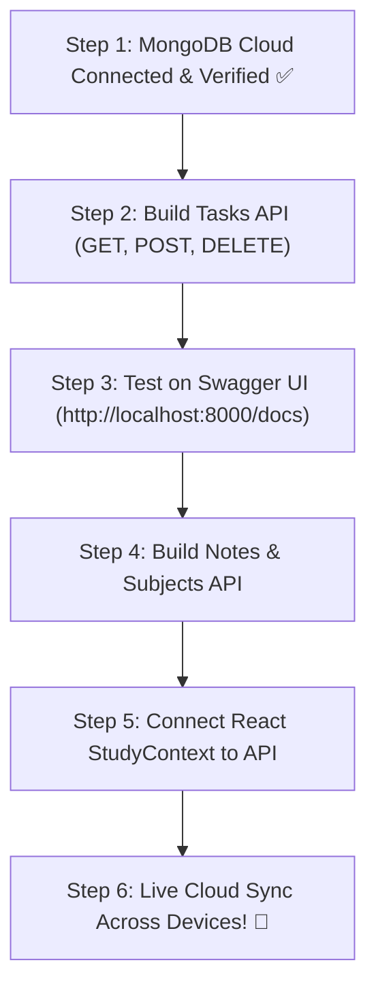

# ⚡ STUDY MATE — FULL BACKEND ARCHITECTURE & MASTER GUIDE ⚡
> *A complete, beginner-friendly reference for how our Python FastAPI + MongoDB Cloud backend works.*

---

## 📑 TABLE OF CONTENTS
1. [The Big Picture: What is a Backend?](#1-the-big-picture-what-is-a-backend)
2. [Our Tech Stack & Why We Chose It](#2-our-tech-stack--why-we-chose-it)
3. [The 3-Tier Architecture Diagram](#3-the-3-tier-architecture-diagram)
4. [How FastAPI Works (The Brain)](#4-how-fastapi-works-the-brain)
5. [How MongoDB Cloud Works (The Memory)](#5-how-mongodb-cloud-works-the-memory)
6. [The 5 Core Features We Are Building (CRUD)](#6-the-5-core-features-we-are-building-crud)
7. [Step-by-Step Execution Plan](#7-step-by-step-execution-plan)
8. [Developer Cheat Sheet & Commands](#8-developer-cheat-sheet--commands)

---

## 1. The Big Picture: What is a Backend?

Right now, your React app (**Study Mate**) is a **Frontend**.
- It runs inside the user's browser (Chrome, Edge, Brave, etc.).
- When you add a task, it saves to `localStorage` (inside that specific browser on that specific computer).
- **The Problem:** If you clear your browser cache, open incognito mode, or switch to your phone, **all your data disappears!**

### The Solution: A Real Backend
A backend is a computer program running on a server that:
1. **Listens** for requests from your React app (e.g. *"Give me all my tasks"*, *"Add this new note"*).
2. **Processes & Validates** the data (checks that the title is not empty, dates are valid, etc.).
3. **Stores** the data permanently in **MongoDB Cloud (Atlas)** so it is safely stored in the cloud forever, accessible from anywhere.

---

## 2. Our Tech Stack & Why We Chose It

| Tool | Role | Why It Rocks |
| :--- | :--- | :--- |
| **Python 3.12** | Core Language | Clean, simple syntax, massive ecosystem, easy to read. |
| **FastAPI** | Web Framework | The fastest modern Python web framework. Comes with automatic interactive documentation at `/docs`! |
| **Uvicorn** | ASGI Web Server | The engine that serves FastAPI requests at lightning speed. |
| **Motor** | Async MongoDB Driver | Allows Python to talk to MongoDB asynchronously without freezing the server. |
| **Pydantic** | Data Validator | Ensures incoming data has the right types (e.g., strings, numbers, booleans). |
| **MongoDB Atlas** | Cloud Database | Scalable NoSQL cloud database that stores data as JSON-like documents. |

---

## 3. The 3-Tier Architecture Diagram

```text
┌────────────────────────────────┐
│      1. REACT FRONTEND         │  UI Layer (Runs in User's Browser)
│      (http://localhost:5173)   │  Components, Buttons, State, Theme
└───────────────┬────────────────┘
                │
                │ HTTP Requests (JSON)
                │ GET /api/tasks, POST /api/tasks
                ▼
┌────────────────────────────────┐
│      2. FASTAPI BACKEND        │  Logic Layer (Runs on Server)
│      (http://localhost:8000)   │  Validates data, routes requests, handles CORS
└───────────────┬────────────────┘
                │
                │ Async Driver (Motor / TCP Port 27017)
                │ Queries: find(), insert_one(), delete_one()
                ▼
┌────────────────────────────────┐
│   3. MONGODB ATLAS CLOUD       │  Database Layer (AWS / Google Cloud)
│   (studymate.kqdkjqn.mongodb)  │  Permanent Storage for Collections
└────────────────────────────────┘
```

---

## 4. How FastAPI Works (The Brain)

FastAPI works using **HTTP Methods** (verbs) and **URL Endpoints**:

| Method | What It Means | Real Life Analogy | Example in Study Mate |
| :--- | :--- | :--- | :--- |
| **`GET`** | Fetch data | Reading a book | `GET /api/tasks` (Get all tasks) |
| **`POST`** | Create new data | Writing a new page | `POST /api/tasks` (Create a new task) |
| **`PUT`** | Update existing data | Editing a paragraph | `PUT /api/tasks/{id}` (Edit title or date) |
| **`PATCH`**| Partially update | Checking a checkbox | `PATCH /api/tasks/{id}/toggle` (Done/Undone) |
| **`DELETE`**| Remove data | Tearing out a page | `DELETE /api/tasks/{id}` (Delete task) |

### Key Concept: `async` and `await`
FastAPI is **asynchronous**:
- When FastAPI asks MongoDB for tasks, it doesn't freeze the whole server while waiting.
- It says: *"MongoDB, get me the tasks. While you do that (`await`), I will help the next user!"*
- This is why FastAPI can handle tens of thousands of requests per second easily.

### Key Concept: Pydantic Schemas
Before inserting into MongoDB, Pydantic acts like a **security guard at the door**:
```python
from pydantic import BaseModel

class TaskInput(BaseModel):
    title: str          # Must be text! Cannot be blank!
    subject: str = "General"
    priority: str = "Medium"
    completed: bool = False
```
If React sends bad data (like sending a number instead of a string), FastAPI automatically catches it and returns a helpful error!

---

## 5. How MongoDB Cloud Works (The Memory)

MongoDB is a **NoSQL Document Database**. Unlike old SQL tables with strict columns, MongoDB stores data in **Collections** containing **Documents** (which look just like JavaScript JSON objects).

### The Hierarchy:
- **Cluster**: Your Atlas cloud server (`studymate.kqdkjqn.mongodb.net`)
- **Database**: `studymate`
- **Collections**:
  - `tasks` ➔ Stores all tasks
  - `notes` ➔ Stores study notes
  - `subjects` ➔ Stores courses/subjects
  - `schedule` ➔ Stores calendar/timetable events
  - `sessions` ➔ Stores Pomodoro / Focus timer logs

### Example MongoDB Document:
```json
{
  "_id": "65f2a1b9c3e4f8d21a9e3b4a",
  "title": "Solve 10 Calculus Problems",
  "subject": "Mathematics",
  "priority": "High",
  "dueDate": "2026-09-15",
  "completed": false,
  "createdAt": "2026-09-12T16:00:00Z"
}
```
Notice `_id`: MongoDB gives every document a unique 24-character hexadecimal fingerprint called an **`ObjectId`**.

---

## 6. The 5 Core Features We Are Building (CRUD)

CRUD stands for: **Create**, **Read**, **Update**, **Delete**.

### 1️⃣ Tasks Module (`/api/tasks`)
- `GET /api/tasks` ➔ List all tasks.
- `POST /api/tasks` ➔ Add a new task (`{ title, subject, priority, dueDate }`).
- `PATCH /api/tasks/{id}/toggle` ➔ Toggle `completed` true/false.
- `DELETE /api/tasks/{id}` ➔ Delete a task by ID.

### 2️⃣ Notes Module (`/api/notes`)
- `GET /api/notes` ➔ Fetch all notes.
- `POST /api/notes` ➔ Add a note (`{ title, content, subject, tags, pinned }`).
- `PUT /api/notes/{id}` ➔ Edit note content or title.
- `DELETE /api/notes/{id}` ➔ Delete note.

### 3️⃣ Subjects Module (`/api/subjects`)
- `GET /api/subjects` ➔ Fetch subject cards.
- `POST /api/subjects` ➔ Add a subject (`{ name, code, teacher, color }`).
- `DELETE /api/subjects/{id}` ➔ Remove subject.

### 4️⃣ Schedule Module (`/api/schedule`)
- `GET /api/schedule` ➔ Fetch calendar study sessions.
- `POST /api/schedule` ➔ Add schedule slot (`{ title, date, startTime, endTime }`).
- `DELETE /api/schedule/{id}` ➔ Delete schedule entry.

### 5️⃣ Study Timer Sessions (`/api/sessions`)
- `GET /api/sessions` ➔ Get your total study hours and streaks.
- `POST /api/sessions` ➔ Record a completed 25-minute Pomodoro session.

---

## 7. Step-by-Step Execution Plan



1. **Step 1 (Done!)**: We created `Backend/`, set up `.env`, and verified connection to Atlas Cloud.
2. **Step 2**: Create `routes/tasks.py` to handle adding and listing tasks in MongoDB.
3. **Step 3**: Test the endpoints right in your browser using the Swagger UI (`/docs`).
4. **Step 4**: Repeat the pattern for Notes, Subjects, and Schedule.
5. **Step 5**: Update React's `studycontext.jsx` to fetch from `http://localhost:8000/api` instead of only `localStorage`.
6. **Step 6**: Enjoy your fully functional, full-stack study app!

---

## 8. Developer Cheat Sheet & Commands

### How to Run the Backend:
Open PowerShell, navigate to `Backend`, and run:
```powershell
cd "C:\Users\Ayush Bhandari\webdev\study-mate\Backend"
.\venv\Scripts\activate
uvicorn main:app --reload --port 8000
```
- `--reload` means the server restarts automatically whenever you save a Python file!
- `--port 8000` sets the server port.

### Interactive Swagger Docs:
Open in browser while the server is running:
- **`http://localhost:8000/docs`** ➔ Full visual UI to test every API route without writing any frontend code!

### How to Run the Frontend:
In a second terminal:
```powershell
cd "C:\Users\Ayush Bhandari\webdev\study-mate\studymate"
npm run dev
```
Runs at: **`http://localhost:5173`**

---
*Created for Study Mate — Ready to build the future of studying!*
